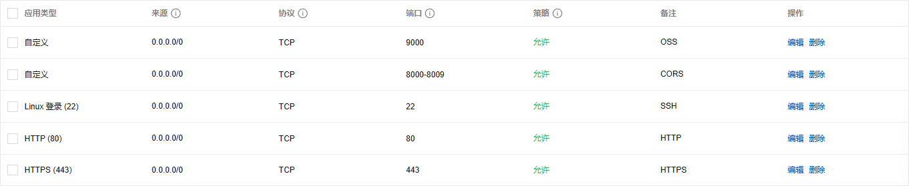
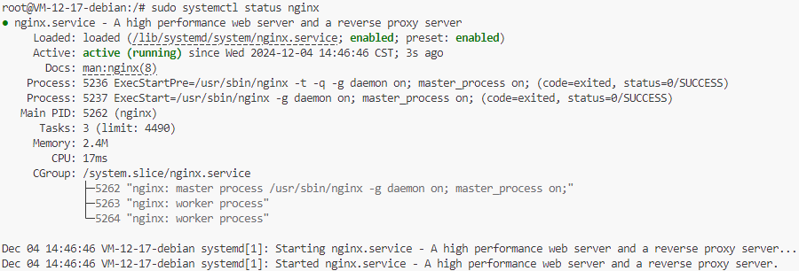
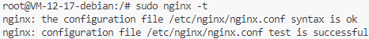
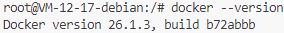

# 腾讯云 Ngnix 配置文档

> [!TIP]
> 服务器镜像已保存为 ICW-Proxy-Environment

## 配置服务器防火墙

开放服务器端口 8000-8009 用于跨域资源共享（CORS），开放服务器端口 9000 用于智慧幕墙数据集管理平台后端应用程序：



## 配置 Ngnix

更新系统软件包列表并安装 Ngnix：

```bash
sudo apt update
sudo apt install nginx
```

检查 Nginx 是否正常运行：

```bash
sudo systemctl status nginx
```



## 配置跨域资源共享（CORS）

编辑 `proxy_params` 文件：

```bash
sudo nano /etc/nginx/proxy_params
```

```
proxy_http_version 1.1;
proxy_set_header Upgrade $http_upgrade;
proxy_set_header Connection "upgrade";
proxy_set_header Host $host;
proxy_set_header X-Real-IP $remote_addr;
proxy_set_header X-Forwarded-For $proxy_add_x_forwarded_for;
proxy_set_header X-Forwarded-Proto $scheme;
proxy_set_header X-Forwarded-Host $server_name;

proxy_hide_header 'Access-Control-Allow-Origin';
proxy_hide_header 'Access-Control-Allow-Methods';
proxy_hide_header 'Access-Control-Allow-Headers';

add_header 'Access-Control-Allow-Origin' '$http_origin' always;
add_header 'Access-Control-Allow-Methods' 'GET, POST, OPTIONS' always;
add_header 'Access-Control-Allow-Headers' 'DNT,X-CustomHeader,Keep-Alive,User-Agent,X-Requested-With,If-Modified-Since,Cache-Control,Content-Type,Authorization' always;
add_header 'Access-Control-Allow-Credentials' 'true' always;
add_header 'Access-Control-Max-Age' 1728000 always;

if ($request_method = 'OPTIONS') {
    add_header 'Access-Control-Allow-Origin' '$http_origin' always;
    add_header 'Access-Control-Allow-Methods' 'GET, POST, OPTIONS' always;
    add_header 'Access-Control-Allow-Headers' 'DNT,X-CustomHeader,Keep-Alive,User-Agent,X-Requested-With,If-Modified-Since,Cache-Control,Content-Type,Authorization' always;
    add_header 'Access-Control-Allow-Credentials' 'true' always;
    add_header 'Content-Type' 'text/plain; charset=UTF-8' always;
    add_header 'Content-Length' 0 always;
    return 204;
}
```

编辑 `proxy` 文件：

```bash
sudo nano /etc/nginx/sites-available/proxy
```

```
server {
    listen 8000;
    location / {
        proxy_pass https://hz-4.matpool.com:27450;
        include proxy_params;
    }
}

server {
    listen 8001;
    location / {
        proxy_pass https://hz-4.matpool.com:26526;
        include proxy_params;
    }
}

server {
    listen 8002;
    location / {
        proxy_pass https://hz-4.matpool.com:26208;
        include proxy_params;
    }
}

server {
    listen 8003;
    location / {
        proxy_pass https://hz-4.matpool.com:27142;
        include proxy_params;
    }
}

server {
    listen 8004;
    location / {
        proxy_pass https://hz-t3.matpool.com:27515;
        include proxy_params;
    }
}

server {
    listen 8005;
    location / {
        proxy_pass https://hz-t3.matpool.com:26519;
        include proxy_params;
    }
}

server {
    listen 8006;
    location / {
        proxy_pass https://hz-t3.matpool.com:27183;
        include proxy_params;
    }
}

server {
    listen 8007;
    location / {
        proxy_pass https://hz-t3.matpool.com:28179;
        include proxy_params;
    }
}

server {
    listen 8008;
    location / {
        proxy_pass https://hz-4.matpool.com:29900;
        include proxy_params;
    }
}

server {
    listen 8009;
    location / {
        proxy_pass https://hz-t3.matpool.com:27847;
        include proxy_params;
    }
}
```

激活站点：

```bash
sudo ln -s /etc/nginx/sites-available/proxy /etc/nginx/sites-enabled/
```

测试 Nginx 配置文件正确性：

```bash
sudo nginx -t
```



重启 Nginx 服务：

```bash
sudo systemctl restart nginx
```

## 配置数据集管理平台

将数据集管理平台部署文件上传至 `/home/lighthouse/userinterface` 文件夹。

编辑 `default` 文件：

```bash
sudo nano /etc/nginx/sites-available/default
```

```
server {
    listen 80;
    server_name 110.42.214.164;

    root /home/lighthouse/userinterface;
    index index.html;

    location / {
        try_files $uri $uri/ /index.html;
    }
}
```

测试 Nginx 配置文件正确性：

```bash
sudo nginx -t
```


重启 Nginx 服务：

```bash
sudo systemctl restart nginx
```

查看 Docker 版本：

```bash
docker --version
```



部署智慧幕墙数据集管理平台后端应用程序镜像：

```bash
sudo docker pull minmuslin/intelligent-curtain-wall:oss-management
sudo docker run -d -p 9000:8080 --name oss-management minmuslin/intelligent-curtain-wall:oss-management
```

## 配置 SSH 密钥

生成 SSH 密钥对：

```bash
ssh-keygen -t rsa -b 4096 -C "minmuslin@outlook.com"
```

将公钥添加到 `~/.ssh/authorized_keys`：

```bash
cat ~/.ssh/id_rsa.pub >> ~/.ssh/authorized_keys
```

确保权限正确：

```bash
chmod 600 ~/.ssh/authorized_keys
chmod 700 ~/.ssh
```

复制私钥内容：

```bash
cat ~/.ssh/id_rsa
```
