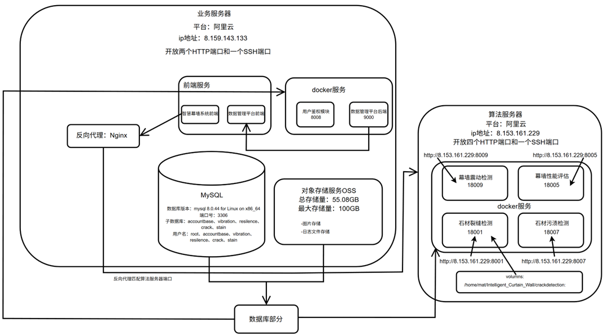

# 智慧幕墙项目维护手册

[toc]

## 文档概述

### 文档目的

本维护手册用于指导智慧幕墙监测平台在部署上线后的日常运维、故障排查、版本更新、数据备份、安全管理与应急恢复工作。通过规范系统维护流程、明确维护对象与操作步骤，保障平台在长期运行过程中的稳定性、可用性、安全性与可扩展性。

### 适用范围

本手册适用于智慧幕墙项目的前端服务、后端业务服务、算法推理服务、数据库、对象存储、Nginx 网关、Docker 容器、CI/CD 自动化部署流程以及服务器基础运行环境的维护工作。

### 适用人员

本手册主要面向以下人员：

1. 项目运维人员：负责服务器、容器、网络、日志、备份与部署维护。
2. 后端开发人员：负责业务接口、数据库访问、用户认证、系统异常定位。
3. 前端开发人员：负责前端页面发布、接口联调、资源路径与环境变量维护。
4. 算法模块维护人员：负责裂缝检测、污渍检测、腐蚀检测、振动监测、幕墙评估等智能分析模块的模型、服务与接口维护。
5. 项目管理人员：负责版本变更审批、维护记录归档与风险跟踪。

---

## 系统总体维护对象

### 系统组成

智慧幕墙平台整体采用前后端分离、网关统一入口、业务服务与算法服务解耦的部署模式。系统主要包括以下组成部分：

1. 前端展示层  
   基于 Vue.js / Nuxt.js 构建，负责用户登录、数据集管理、检测工作台、结果展示、振动监测可视化、幕墙状态评估等页面功能。

2. API 网关层  
   由 Nginx 负责统一请求入口、静态资源分发、反向代理、路径转发、跨服务路由和基础访问控制。

3. 后端业务层  
   主要由 Spring Boot 服务和 Python 服务组成，负责用户认证、权限控制、数据管理、设备管理、任务调度、检测结果管理、报警记录管理等功能。

4. 算法推理层  
   包括裂缝检测、污渍检测、腐蚀检测、幕墙振动分析、幕墙韧性/状态评估等模块，通常以 Docker 容器方式运行，对外提供 HTTP API。

5. 数据存储层  
   MySQL 用于存储用户、设备、检测任务、结构化监测数据和异常记录；阿里云 OSS 用于存储图片、检测结果、报告文件、模型相关文件等非结构化数据。

6. 运维支撑层  
   包括 Docker / Docker Compose、GitHub Actions、日志系统、监控脚本、备份脚本、Nginx 配置、服务器防火墙与系统定时任务。

### 推荐部署结构

系统推荐采用“业务服务器 + 推理服务器”的两层部署结构：

1. 业务服务器  
   部署 Nginx、前端静态资源、用户认证后端、数据集管理后端、设备管理服务、数据库连接服务以及通用业务 API。

2. 推理服务器  
   部署裂缝检测、污渍检测、腐蚀检测、振动分析、幕墙状态评估等算法服务，必要时配置 GPU、CUDA、深度学习框架和模型文件。

该结构能够降低不同服务之间的资源竞争，便于分别扩展业务访问能力和算法推理能力。

---

## 服务器基础维护

### 服务器信息登记

维护人员应建立服务器信息表，并在每次服务器变更后及时更新。

| 服务器角色 | 公网 IP | 操作系统 | 主要用途 | 维护负责人 |
|---|---|---|---|---|
| 业务服务器 | 8.159.143.133 | Ubuntu | 前端、Nginx、业务后端、数据库访问 | 谭、柴 |
| 推理服务器 | 8.153.161.229 | Ubuntu | 算法模型推理、GPU 任务、算法接口 | 谭、刘、徐 |
| 数据库服务器 | 8.159.143.133 | Ubuntu | MySQL 数据存储 | 谭、柴、刘、徐 |

服务器部署图：


### 常用登录命令

```bash
ssh -p <SSH端口> <用户名>@<服务器IP>
```

示例：

```bash
ssh -p 22 ecs-user@8.159.143.133
```

如服务器使用非默认 SSH 端口，应以实际端口为准。

### 基础状态检查

登录服务器后，可使用以下命令检查系统状态：

```bash
# 查看系统运行时间与负载
uptime

# 查看内存使用情况
free -h

# 查看磁盘空间
df -h

# 查看目录空间占用
du -sh /var/* 2>/dev/null

# 查看 CPU 和内存占用较高的进程
top

# 查看端口监听情况
ss -tulnp

# 查看网络连通性
ping -c 4 8.8.8.8
```

### 磁盘空间维护

系统运行过程中，Docker 镜像、容器日志、Nginx 日志、模型输出文件、临时检测文件等可能导致磁盘空间逐渐增大。建议每周检查一次磁盘空间。

常用清理命令：

```bash
# 查看 Docker 占用空间
docker system df

# 清理未使用的镜像、容器、网络和缓存
docker system prune -f

# 清理未使用的镜像
docker image prune -a -f

# 查看大文件
find / -type f -size +500M 2>/dev/null

# 查看指定目录下各文件夹大小
du -h --max-depth=1 /home/ecs-user | sort -hr
```

注意：执行 `docker image prune -a -f` 前应确认当前生产服务所需镜像不会被误删。对于正在运行的容器，Docker 通常不会删除其正在使用的镜像，但仍建议在维护窗口内执行。

---

## Nginx 网关维护

### Nginx 作用

Nginx 是智慧幕墙平台的统一访问入口，主要承担以下职责：

1. 提供前端静态资源访问。
2. 将 `/api/`、`/detection-api/`、`/corrosion/` 等路径转发到不同后端服务。
3. 屏蔽内部服务端口，降低外部暴露面。
4. 支持跨服务反向代理和请求路径重写。
5. 为后续 HTTPS、访问限流、日志审计和负载均衡提供基础。

### 常用 Nginx 命令

```bash
# 检查配置语法
sudo nginx -t

# 重新加载配置
sudo systemctl reload nginx

# 重启 Nginx
sudo systemctl restart nginx

# 查看 Nginx 状态
sudo systemctl status nginx

# 查看错误日志
sudo tail -f /var/log/nginx/error.log

# 查看访问日志
sudo tail -f /var/log/nginx/access.log
```

### 配置文件位置

常见配置文件位置如下：

```text
/etc/nginx/nginx.conf
/etc/nginx/sites-available/
/etc/nginx/sites-enabled/
```

若采用站点配置文件方式，通常先在 `sites-available` 中编写配置，再通过软链接启用：

```bash
sudo ln -s /etc/nginx/sites-available/curtainwall /etc/nginx/sites-enabled/curtainwall
sudo nginx -t
sudo systemctl reload nginx
```

### 反向代理维护要点

维护 Nginx 配置时，应重点检查以下内容：

1. `server_name` 是否与实际域名或 IP 一致。
2. `root` 或 `alias` 指向的前端静态资源目录是否正确。
3. `proxy_pass` 指向的后端服务地址和端口是否正确。
4. 是否存在路径前缀重复或被错误重写的问题。
5. 是否正确保留请求头，如 `Host`、`X-Real-IP`、`X-Forwarded-For`。
6. 前端接口路径与后端 `@RequestMapping` 路径是否一致。

示例配置片段：

```nginx
server {
    listen 80;
    server_name <服务器IP或域名>;

    location / {
        root /var/www/integrated-frontend;
        index index.html;
        try_files $uri $uri/ /index.html;
    }

    location /api/ {
        proxy_pass http://127.0.0.1:8008;
        proxy_set_header Host $host;
        proxy_set_header X-Real-IP $remote_addr;
        proxy_set_header X-Forwarded-For $proxy_add_x_forwarded_for;
        proxy_set_header X-Forwarded-Proto $scheme;
    }

    location /corrosion-api/ {
        proxy_pass http://127.0.0.1:18007/;
        proxy_set_header Host $host;
        proxy_set_header X-Real-IP $remote_addr;
    }
}
```

### 路径重写注意事项

如果后端接口本身已经包含 `/api` 前缀，则 Nginx 不应随意将 `/api` 去掉。否则可能出现后端日志中提示 `No static resource api/account/login` 或接口路径不匹配的问题。

维护原则如下：

1. 前端请求路径、Nginx 转发路径、后端 Controller 映射路径三者必须统一。
2. 修改 `rewrite` 前，应先用 `curl` 分别测试 Nginx 外部入口和后端内部入口。
3. 避免同时在前端环境变量和 Nginx 中重复添加相同路径前缀。

---

## Docker 与容器维护

### Docker 服务状态检查

```bash
# 查看 Docker 状态
sudo systemctl status docker

# 启动 Docker
sudo systemctl start docker

# 重启 Docker
sudo systemctl restart docker

# 设置开机自启
sudo systemctl enable docker
```

### 查看容器状态

```bash
# 查看正在运行的容器
docker ps

# 查看所有容器
docker ps -a

# 查看容器日志
docker logs -f <容器名或容器ID>

# 查看最近 200 行日志
docker logs --tail=200 <容器名或容器ID>

# 进入容器内部
docker exec -it <容器名或容器ID> /bin/bash
```

如果容器内没有 bash，可使用：

```bash
docker exec -it <容器名或容器ID> /bin/sh
```

### Docker Compose 常用命令

```bash
# 启动服务
docker compose up -d

# 停止服务
docker compose down

# 重新构建并启动
docker compose up -d --build

# 查看服务状态
docker compose ps

# 查看服务日志
docker compose logs -f

# 查看指定服务日志
docker compose logs -f <服务名>
```

旧版本环境可能使用 `docker-compose`：

```bash
docker-compose up -d
docker-compose down
docker-compose logs -f
```

### 主要容器服务登记

| 服务名称 | 容器名称 | 默认端口 | 主要功能 | 维护重点 |
|---|---|---|---|---|
| 用户认证服务 | user-authentication | 8008:8000 | 登录、注册、JWT、权限控制 | 数据库连接、接口路径、JWT 配置 |
| 裂缝检测服务 | crack-detection | 18001:8080 | 石材裂缝检测 | 模型文件、图片输入输出、GPU/CPU 资源 |
| 污渍检测服务 | stain-detection | 18007:8080 | 石材污渍识别 | 模型版本、图片路径、推理接口 |
| 腐蚀检测服务 | corrosion-detection | 视实际配置 | 金属腐蚀检测 | YOLO 模型选择、检测结果解析 |
| 韧性评估服务 | resilience-assessment | 18005:8080 | 幕墙状态/韧性评估 | 指标权重、评估算法、数据库输入 |
| 振动监测服务 | vibration-detection | 视实际配置 | 振动/应变数据分析 | 数据库查询、阈值配置、报警逻辑 |

### 容器异常处理流程

当某个服务不可用时，按以下顺序排查：

1. 查看容器是否运行：

```bash
docker ps -a | grep <服务名>
```

2. 查看容器日志：

```bash
docker logs --tail=200 <容器名>
```

3. 检查端口是否监听：

```bash
ss -tulnp | grep <端口号>
```

4. 在服务器本机测试接口：

```bash
curl -v http://127.0.0.1:<端口>/<接口路径>
```

5. 通过 Nginx 外部入口测试接口：

```bash
curl -v http://<服务器IP>/<代理路径>
```

6. 如服务异常退出，尝试重启：

```bash
docker restart <容器名>
```

7. 如镜像或配置变更后异常，执行回滚或恢复旧版本镜像。

---

## 前端服务维护

### 前端维护对象

前端维护主要包括以下内容：

1. Nuxt / Vue 项目源码。
2. 前端环境变量配置。
3. 构建产物目录，如 `.output`、`dist` 或静态生成目录。
4. Nginx 静态资源目录，如 `/var/www/integrated-frontend`、`/var/www/dataset-frontend`。
5. API Base URL、算法服务地址、监控服务地址等运行时配置。

### 前端构建流程

常见构建命令如下：

```bash
# 安装依赖
npm install

# 开发运行
npm run dev

# 构建生产版本
npm run build

# 静态生成
npm run generate
```

构建完成后，将产物复制到 Nginx 对应目录：

```bash
sudo rm -rf /var/www/integrated-frontend/*
sudo cp -r .output/public/* /var/www/integrated-frontend/
sudo systemctl reload nginx
```

如果使用 `dist` 目录：

```bash
sudo rm -rf /var/www/integrated-frontend/*
sudo cp -r dist/* /var/www/integrated-frontend/
sudo systemctl reload nginx
```

### 前端环境变量维护

前端常见环境变量包括：

```text
NUXT_API_BASE_URL=<业务后端地址>
NUXT_CORROSION_API_BASE_URL=<腐蚀检测服务地址>
NUXT_SERVER_MONITOR_UPSTREAM=<监控服务上游地址>
```

维护要点：

1. 本地开发环境可使用 `.env` 文件。
2. 生产部署环境应通过 CI/CD Secrets 或服务器环境变量注入。
3. 不应在前端代码中硬编码敏感信息。
4. 修改环境变量后，需要重新构建前端项目。
5. 若使用 Nuxt runtimeConfig，应区分服务端配置与客户端公开配置。

### 前端接口异常排查

当前端页面无法访问后端接口时，按以下顺序排查：

1. 打开浏览器开发者工具，查看 Network 请求路径、状态码和返回内容。
2. 确认请求路径是否符合 Nginx 代理规则。
3. 在服务器使用 `curl` 测试同一接口。
4. 检查 Nginx 日志是否出现 404、502、504。
5. 检查后端容器日志是否收到请求。
6. 确认 CORS、JWT Token、请求方法、请求体格式是否正确。

常见状态码说明：

| 状态码 | 含义 | 可能原因 |
|---|---|---|
| 400 | 请求参数错误 | 参数缺失、格式错误、类型不匹配 |
| 401 | 未认证 | Token 缺失、Token 过期、登录失败 |
| 403 | 无权限 | 角色权限不足、接口被安全策略拦截 |
| 404 | 路径不存在 | 前端路径、Nginx 路径、后端路径不一致 |
| 500 | 服务内部错误 | 后端异常、数据库异常、模型推理异常 |
| 502 | 网关错误 | Nginx 无法连接上游服务 |
| 504 | 网关超时 | 算法推理耗时过长或后端服务无响应 |

---

## 后端业务服务维护

### 后端服务维护对象

后端业务服务主要包括：

1. 用户认证与权限管理服务。
2. 数据集管理服务。
3. 检测任务管理服务。
4. 设备信息管理服务。
5. 振动与应变数据查询服务。
6. 异常报警记录服务。
7. 文件上传与 OSS 存储服务。
8. 算法服务调用与结果汇总接口。

### 后端运行状态检查

```bash
# 查看后端容器
docker ps | grep backend

# 查看用户认证服务日志
docker logs -f user-authentication

# 测试登录接口
curl -v -X POST http://127.0.0.1:8008/api/account/login \
  -H "Content-Type: application/json" \
  -d '{"username":"test","password":"test"}'
```

如果接口路径实际不包含 `/api`，应根据后端 Controller 配置调整测试路径。

### Spring Boot 服务维护要点

1. 检查 `application.yml` 或环境变量中的数据库连接信息。
2. 检查 JWT 密钥、过期时间、权限白名单配置。
3. 检查 CORS 配置是否允许前端域名。
4. 检查日志中是否存在数据库连接失败、端口占用、Bean 初始化失败等错误。
5. 修改接口路径后，应同步更新前端请求路径和 Nginx 代理规则。
6. 生产环境不应输出过多 Debug 级别日志，避免日志文件快速膨胀。

### Python / Django / FastAPI 服务维护要点

若振动监测、算法调度或数据分析模块采用 Python 服务，应关注以下内容：

1. Python 版本和依赖包版本是否与部署文档一致。
2. 深度学习框架版本是否与模型文件兼容。
3. 数据库连接池是否正常释放连接。
4. 图像处理任务是否存在临时文件堆积。
5. 推理接口是否设置超时时间和异常返回格式。
6. GPU 服务应关注显存占用和 CUDA 版本兼容性。

常用检查命令：

```bash
# 查看 Python 服务日志
docker logs -f <python-service-container>

# 查看 GPU 状态
nvidia-smi

# 查看 Python 进程
ps aux | grep python
```

---

## 算法服务维护

### 算法模块范围

智慧幕墙项目的算法服务主要包括：

1. 石材裂缝检测模块。
2. 石材污渍检测模块。
3. 金属腐蚀检测模块。
4. 幕墙振动监测模块。
5. 幕墙应变分析模块。
6. 幕墙韧性或安全状态评估模块。

### 模型文件维护

算法模型文件应统一管理，建议采用以下目录结构：

```text
/home/ecs-user/Intelligent_Curtain_Wall/
├── crack-detection/
│   └── models/
├── stain-detection/
│   └── models/
├── corrosion-detection/
│   └── models/
├── resilience-assessment/
│   └── configs/
└── vibration-detection/
    └── configs/
```

维护要求：

1. 模型文件应记录版本号、训练数据来源、训练时间、主要指标和负责人。
2. 新模型上线前必须在测试环境验证。
3. 模型替换前应备份旧模型。
4. 模型路径变更后，应同步修改 Docker volume、环境变量或配置文件。
5. 大模型文件不建议直接提交到 Git 仓库，应使用 OSS、服务器目录或模型仓库管理。

### 腐蚀检测模型维护示例

腐蚀检测模块可能提供模型列表接口，例如：

```bash
curl http://127.0.0.1/api/corrosion/models
```

返回中可能包含不同 YOLO 模型，如：

```text
yolo11n.pt
yolo11s.pt
rust_yolo11n_train1
rust_yolo11s_train_preproc
```

维护时应确认：

1. 前端展示的模型名称与后端模型 key 一致。
2. 后端模型 key 能正确映射到实际模型文件。
3. 模型文件存在且容器有读取权限。
4. 推理接口返回格式与前端解析逻辑一致。

### 算法接口异常排查

当检测接口失败时，按以下步骤排查：

1. 检查算法容器是否运行。
2. 检查模型文件是否存在。
3. 检查输入图片是否上传成功。
4. 检查图片格式是否支持。
5. 检查推理日志是否出现 CUDA、OpenCV、PyTorch、路径权限错误。
6. 检查接口响应时间是否超过 Nginx 或前端超时限制。
7. 检查输出结果是否符合前端字段要求。

常见问题及处理方式：

| 问题 | 可能原因 | 处理方式 |
|---|---|---|
| 检测接口 500 | 模型加载失败、图片读取失败、代码异常 | 查看算法容器日志，确认模型路径和输入格式 |
| 检测接口 504 | 推理时间过长 | 优化模型、提高超时时间、限制图片大小 |
| 检测结果为空 | 模型置信度过高、图片质量差 | 调整阈值，检查模型版本 |
| GPU 显存不足 | 多个模型同时加载 | 清理进程、减少并发、拆分服务 |
| 前端无法显示结果 | 返回字段不匹配 | 对照接口文档修正字段名和数据结构 |

---

## 数据库维护

### 数据库URI

mysql://用户名:密码@8.159.143.133:3306/数据库名

| 数据库名             | 对应模块              | 功能用途                           | 用户名           | 密码            |
| -------------------- | --------------------- | ---------------------------------- | ---------------- | --------------- |
| `accountdatabase`    | 账户/权限模块         | 用户登录、权限、角色、认证信息     | accountdatabase  | accountdatabase |
| `corrosion`          | 金属锈蚀模块          | 金属幕墙锈蚀/污损检测数据          | corrosion        | corrosion       |
| `crack`              | 裂缝检测模块          | 石材/幕墙裂缝检测数据              | crack            | crack           |
| `flatness`           | 平整度检测模块        | 幕墙平整度/形变相关数据            | flatness         | flatness        |
| `mobiledata`         | 移动端/采集端数据模块 | 移动端上传、采集数据               | mobiledata       | mobiledata      |
| `model`              | 模型管理模块          | 算法模型、模型配置、模型记录       | model            | model           |
| `resilience`         | 韧性/性能评估模块     | 幕墙性能评估、韧性评估数据         | resilience       | resilience      |
| `stain`              | 污渍检测模块          | 石材污渍检测数据                   | stain            | stain           |
| `vibration`          | 振动监测模块          | 传感器、加速度、应变、异常告警数据 | vibration        | vibration       |
| `mysql`              | MySQL 系统库          | 用户、权限、系统配置               | MySQL 内部系统库 |                 |
| `sys`                | MySQL 系统库          | 性能/诊断视图                      | MySQL 内部系统库 |                 |
| `information_schema` | MySQL 系统库          | 元数据、表结构信息                 | MySQL 内部系统库 |                 |
| `performance_schema` | MySQL 系统库          | 性能监控信息                       | MySQL 内部系统库 |                 |

管理员账号：root，密码：1208tzc@（可自行修改）

目前正在使用：corrosion、crack、resilience、stain、vibration、accountdatabase

### 数据库维护范围

智慧幕墙项目使用 MySQL 存储结构化数据，主要包括：

1. 用户信息与权限数据。
2. 设备信息与阈值配置。
3. 数据集元数据。
4. 检测任务与检测结果。
5. 振动加速度数据。
6. 应变数据。
7. 异常报警记录。
8. 系统配置与操作日志。

### 关键数据表示例

| 表名 | 主要字段 | 用途 |
|---|---|---|
| user / account | username、password、role、email | 用户认证与权限控制 |
| new_device | device_id、device_name、device_type、limit、offset | 设备信息与阈值配置 |
| new_log_acc | time、x、y、z、device_id、device_name | 加速度监测数据 |
| new_log_strain | time、ch1、ch2、device_id、device_name | 应变监测数据 |
| abnormal / new_abnormal | time、direction、threshold、device_id | 异常记录 |
| dataset_metadata | file_path、oss_path、owner、upload_time | 数据集元数据 |

实际表名应以当前数据库为准。

### 数据库连接检查

```bash
# 登录 MySQL
mysql -h <数据库地址> -P 3306 -u <用户名> -p

# 查看数据库
SHOW DATABASES;

# 切换数据库
USE <数据库名>;

# 查看表
SHOW TABLES;

# 查看表结构
DESC <表名>;

# 查看数据量
SELECT COUNT(*) FROM <表名>;
```

### 数据备份

建议每日进行数据库逻辑备份，并保留至少 7 天的备份文件；重要版本上线前应进行一次手动备份。

备份命令：

```bash
mysqldump -h <数据库地址> -P 3306 -u <用户名> -p \
  --single-transaction --routines --triggers --events \
  <数据库名> > backup_<数据库名>_$(date +%F_%H%M%S).sql
```

压缩备份：

```bash
gzip backup_<数据库名>_*.sql
```

建议备份目录：

```text
/home/ecs-user/backups/mysql/
```

### 数据恢复

恢复前必须确认目标数据库和备份文件是否正确，避免覆盖生产数据。

```bash
mysql -h <数据库地址> -P 3306 -u <用户名> -p <数据库名> < backup.sql
```

如果备份文件为压缩文件：

```bash
gunzip -c backup.sql.gz | mysql -h <数据库地址> -P 3306 -u <用户名> -p <数据库名>
```

### 数据库维护注意事项

1. 不允许在生产环境直接执行未验证的 `DELETE`、`UPDATE`、`DROP` 操作。
2. 执行批量修改前必须先备份相关表。
3. 对监测数据表应定期检查数据量和索引情况。
4. 对按时间查询频繁的表，应为 `time`、`device_id` 等字段建立索引。
5. 长期运行后，可按月份或季度归档历史监测数据。
6. 数据库账号应遵循最小权限原则，不建议业务服务使用 root 账号。

---

## OSS 对象存储维护

### OSS 存储范围

阿里云 OSS 主要用于存储以下非结构化数据：

1. 用户上传的幕墙图片。
2. 裂缝、污渍、腐蚀检测结果图。
3. 检测报告文件。
4. 数据集文件。
5. 模型文件或模型备份。
6. 导出的统计图表与中间结果。

### OSS 维护要求

1. Bucket 权限应按业务需要设置，避免公开敏感数据。
2. 访问密钥应存储在环境变量或 CI/CD Secrets 中，不应写入代码仓库。
3. 定期检查 OSS 文件数量、容量和费用。
4. 对临时文件、中间结果和废弃模型进行周期清理。
5. 重要检测结果和报告应保留备份。

### 常用 ossutil 命令

```bash
# 查看 Bucket 根目录
ossutil ls oss://<bucket-name>

# 查看指定目录
ossutil ls oss://<bucket-name>/<path>/

# 上传文件
ossutil cp local_file oss://<bucket-name>/<path>/

# 下载文件
ossutil cp oss://<bucket-name>/<path>/local_file ./

# 删除文件
ossutil rm oss://<bucket-name>/<path>/file
```

删除 OSS 文件前应确认文件是否仍被数据库记录引用。

---

## CI/CD 自动化部署维护

### CI/CD 流程概述

项目采用 GitHub Actions 实现自动化构建与部署。典型流程如下：

1. 开发人员提交代码到指定分支。
2. GitHub Actions 触发构建任务。
3. 从 Secrets 或私有配置仓库读取部署密钥。
4. 构建前端产物或 Docker 镜像。
5. 推送镜像到 Docker Hub 或镜像仓库。
6. 通过 SSH 登录服务器拉取最新镜像。
7. 执行 Docker Compose 更新服务。
8. 清理无用镜像和缓存。
9. 输出部署结果和日志。

### 维护重点

1. 检查 GitHub Actions Secrets 是否完整。
2. 检查服务器 SSH 私钥是否可用且权限正确。
3. 检查 Docker Hub 用户名、Token、镜像名称是否正确。
4. 检查服务器防火墙是否允许 SSH 连接。
5. 检查部署脚本中的项目路径是否与服务器实际路径一致。
6. 检查 `docker-compose.yml` 中的镜像标签是否与 CI/CD 输出一致。

### 失败排查

| 失败阶段 | 可能原因 | 处理方式 |
|---|---|---|
| 拉取代码失败 | 分支不存在、权限不足 | 检查仓库权限和分支名 |
| 构建失败 | 依赖错误、环境变量缺失 | 查看 Actions 构建日志 |
| 镜像推送失败 | Docker Hub Token 失效 | 更新 Secrets |
| SSH 连接失败 | 私钥错误、防火墙限制 | 检查 SSH Key 和安全组 |
| 服务器拉取镜像失败 | 网络超时、镜像源受限 | 配置代理或镜像加速 |
| 容器启动失败 | 配置错误、端口占用 | 查看容器日志和端口占用 |

### 手动部署流程

当自动化部署失败时，可使用手动部署作为临时方案：

```bash
# 登录服务器
ssh -p <SSH端口> <用户名>@<服务器IP>

# 进入项目目录
cd ~/CurtainWallWeb-Frontend

# 拉取最新代码
git fetch --all --prune
git switch main
git pull

# 构建前端
npm install
npm run build

# 更新静态目录
sudo rm -rf /var/www/integrated-frontend/*
sudo cp -r .output/public/* /var/www/integrated-frontend/
sudo systemctl reload nginx
```

后端容器手动更新示例：

```bash
cd ~/Intelligent_Curtain_Wall/deploy

docker compose pull
docker compose down
docker compose up -d

docker compose ps
docker compose logs --tail=100
```

---

## 日志与监控维护

### 日志类型

系统主要日志包括：

1. Nginx 访问日志和错误日志。
2. Spring Boot 后端日志。
3. Python 算法服务日志。
4. Docker 容器标准输出日志。
5. 数据库慢查询日志。
6. CI/CD 部署日志。
7. 系统安全登录日志。

### 日志查看命令

```bash
# Nginx 错误日志
sudo tail -f /var/log/nginx/error.log

# Nginx 访问日志
sudo tail -f /var/log/nginx/access.log

# Docker 容器日志
docker logs -f <容器名>

# 系统服务日志
journalctl -u docker -f
journalctl -u nginx -f

# SSH 登录记录
last

# 认证日志
sudo tail -f /var/log/auth.log
```

### 监控指标

建议重点监控以下指标：

1. CPU 使用率。
2. 内存使用率。
3. 磁盘空间。
4. 网络出入流量。
5. Docker 容器运行状态。
6. Nginx 5xx 错误数量。
7. 后端接口平均响应时间。
8. 算法推理接口耗时。
9. 数据库连接数和慢查询数量。
10. GPU 显存和利用率。

### 日志清理策略

建议配置日志轮转，避免日志文件占满磁盘。

Docker 容器日志可通过 `/etc/docker/daemon.json` 限制大小：

```json
{
  "log-driver": "json-file",
  "log-opts": {
    "max-size": "100m",
    "max-file": "3"
  }
}
```

修改后重启 Docker：

```bash
sudo systemctl restart docker
```

注意：重启 Docker 会影响正在运行的容器，应在维护窗口执行。

---

## 账号与权限维护

### 系统账号维护

1. 服务器账号应按人员分配，不建议多人共用 root 账号。
2. 禁止使用弱密码。
3. 推荐使用 SSH Key 登录。
4. 离组成员应及时删除服务器访问权限。
5. 重要操作应通过普通用户执行，必要时使用 `sudo`。

### 应用账号维护

智慧幕墙平台内部账号应遵循角色权限控制原则：

1. 管理员：可进行用户管理、设备管理、数据管理、模型配置和系统维护。
2. 普通用户：可上传数据、查看检测结果、使用授权模块。
3. 访客或只读用户：仅可查看公开结果或演示数据。

维护要求：

1. 定期检查管理员账号列表。
2. 禁止将测试账号长期保留在生产环境。
3. 密码应加密存储，不得明文保存。
4. 用户权限变更应记录操作人和变更原因。

### 密钥维护

以下信息属于敏感配置：

1. 数据库用户名和密码。
2. JWT Secret。
3. OSS AccessKey ID 和 AccessKey Secret。
4. Docker Hub Token。
5. GitHub Actions Secrets。
6. SSH 私钥。
7. 邮件服务授权码。
8. 短信服务 AccessKey。

维护要求：

1. 敏感信息不得提交到 Git 仓库。
2. 生产密钥应定期轮换。
3. 密钥泄露后必须立即吊销并重新生成。
4. CI/CD 中应使用 Secrets 管理敏感信息。

---

## 安全维护

### 防火墙维护

生产环境应只开放必要端口，例如：

| 端口 | 用途 | 是否建议公网开放 |
|---|---|---|
| 22 或自定义端口 | SSH | 限制来源 IP |
| 80 | HTTP | 可开放 |
| 443 | HTTPS | 可开放 |
| 3306 | MySQL | 不建议公网开放 |
| 8000/8008 | 后端服务 | 不建议直接公网开放 |
| 18001/18005/18007 | 算法服务 | 不建议直接公网开放 |

建议所有业务服务端口仅监听 `127.0.0.1` 或内网地址，由 Nginx 统一代理。

### 安全检查命令

```bash
# 查看开放端口
ss -tulnp

# 查看登录记录
last

# 查看失败登录
sudo grep "Failed password" /var/log/auth.log

# 查看当前用户
who

# 查看防火墙状态
sudo ufw status
```

### 基础安全策略

1. SSH 禁止 root 直接登录。
2. 使用强密码或密钥登录。
3. 限制数据库公网访问。
4. 后端服务不直接暴露公网端口。
5. 定期更新系统安全补丁。
6. 定期检查 Git 仓库是否误提交密钥。
7. 生产环境关闭详细错误堆栈返回。
8. 上传文件应限制大小、类型和路径。
9. 算法服务应限制单次请求大小，避免恶意大文件导致资源耗尽。

---

## 备份与恢复策略

### 备份对象

必须备份的对象包括：

1. MySQL 数据库。
2. Nginx 配置文件。
3. Docker Compose 文件。
4. 前端生产环境配置。
5. 后端配置文件。
6. 算法模型文件。
7. OSS 中的重要检测结果和报告。
8. CI/CD 配置文件。

### 备份周期

| 备份对象 | 建议周期 | 保留时间 |
|---|---|---|
| MySQL 数据库 | 每日 | 至少 7 天 |
| Nginx 配置 | 每次变更前 | 长期保留 |
| Docker Compose 文件 | 每次变更前 | 长期保留 |
| 模型文件 | 每次更新前 | 至少保留上一稳定版本 |
| OSS 重要结果 | 每周或按项目阶段 | 按项目要求 |
| CI/CD 配置 | 随 Git 仓库版本管理 | 长期保留 |

### 版本上线前备份清单

每次重要版本上线前，应完成以下备份：

1. 导出数据库备份。
2. 备份当前 Nginx 配置。
3. 备份当前 Docker Compose 文件。
4. 记录当前运行镜像标签。
5. 备份当前前端构建产物。
6. 备份当前模型文件或记录模型版本。
7. 记录上线前系统状态和关键接口测试结果。

---

## 版本更新与回滚

### 正常更新流程

1. 开发人员提交代码并完成本地测试。
2. 合并到目标分支前进行代码审查。
3. 在测试环境完成接口和页面验证。
4. 执行数据库备份。
5. 触发 CI/CD 自动部署或手动部署。
6. 部署后检查容器状态、Nginx 状态和关键接口。
7. 验证登录、数据上传、检测任务、结果展示和监测图表等核心功能。
8. 记录更新内容、更新时间、负责人和验证结果。

### 回滚流程

当新版本出现严重故障时，应按以下流程回滚：

1. 暂停继续发布。
2. 确认故障影响范围。
3. 恢复上一版本前端构建产物或回退 Git 版本。
4. 后端服务切换到上一稳定镜像标签。
5. 如涉及数据库结构变更，应根据备份恢复或执行回滚 SQL。
6. 重启相关服务。
7. 验证核心功能。
8. 记录故障原因和回滚结果。

Docker 镜像回滚示例：

```bash
# 修改 docker-compose.yml 中镜像 tag 为上一稳定版本
vim docker-compose.yml

# 重新拉取并启动
docker compose pull
docker compose up -d

# 检查状态
docker compose ps
docker compose logs --tail=100
```

前端回滚示例：

```bash
# 使用备份目录恢复
sudo rm -rf /var/www/integrated-frontend/*
sudo cp -r /home/ecs-user/backups/frontend/<backup-version>/* /var/www/integrated-frontend/
sudo systemctl reload nginx
```

---

## 常见故障处理

### 前端页面无法打开

排查步骤：

1. 检查 Nginx 是否运行。
2. 检查前端静态目录是否存在文件。
3. 检查浏览器控制台是否有资源加载失败。
4. 检查 Nginx 配置中的 `root` 或 `alias` 是否正确。
5. 检查服务器 80/443 端口是否开放。

处理命令：

```bash
sudo systemctl status nginx
sudo nginx -t
sudo systemctl reload nginx
ls -lah /var/www/integrated-frontend
```

### 接口返回 502 Bad Gateway

可能原因：

1. 后端容器未启动。
2. Nginx `proxy_pass` 端口错误。
3. 后端服务只监听容器内部端口，未正确映射到主机。
4. 防火墙或安全组阻断。
5. 后端服务启动失败。

处理步骤：

```bash
docker ps -a
ss -tulnp | grep <端口>
curl -v http://127.0.0.1:<端口>/<接口>
sudo tail -f /var/log/nginx/error.log
```

### 登录接口返回 401 或 403

可能原因：

1. 用户名或密码错误。
2. JWT Token 失效。
3. 权限角色不足。
4. Spring Security 白名单配置错误。
5. 前端未正确携带 Authorization Header。

处理步骤：

1. 检查后端认证日志。
2. 确认登录接口路径正确。
3. 确认请求体字段与后端 DTO 一致。
4. 检查数据库用户记录。
5. 检查前端 Token 存储与请求拦截器逻辑。

### 接口返回 404

可能原因：

1. 前端请求路径错误。
2. Nginx 路径重写错误。
3. 后端 Controller 路径不一致。
4. 服务版本未更新。

处理原则：

使用三段式验证：

```bash
# 直接访问后端容器映射端口
curl -v http://127.0.0.1:<后端端口>/<后端真实路径>

# 访问 Nginx 代理路径
curl -v http://127.0.0.1/<Nginx代理路径>

# 从浏览器访问前端触发同一请求
```

### 算法检测失败

可能原因：

1. 算法容器未启动。
2. 模型文件缺失。
3. 图片上传失败。
4. 输入图片格式不支持。
5. 推理接口超时。
6. GPU 显存不足。
7. 前后端字段格式不一致。

处理步骤：

```bash
docker ps -a | grep detection
docker logs --tail=200 <算法容器名>
nvidia-smi
curl -v http://127.0.0.1:<算法端口>/<健康检查接口>
```

### 数据库连接失败

可能原因：

1. 数据库服务未启动。
2. 数据库账号或密码错误。
3. 数据库地址或端口错误。
4. 安全组或防火墙阻断。
5. 连接数达到上限。

处理步骤：

```bash
systemctl status mysql
ss -tulnp | grep 3306
mysql -h <host> -P 3306 -u <user> -p
SHOW PROCESSLIST;
```

### 磁盘空间不足

可能原因：

1. Docker 日志过大。
2. 历史镜像过多。
3. 检测图片或结果文件堆积。
4. 数据库备份未清理。
5. 系统日志过大。

处理步骤：

```bash
df -h
du -h --max-depth=1 / | sort -hr
docker system df
docker system prune -f
```

---

## 日常巡检清单

### 每日巡检

| 检查项 | 检查方式 | 正常标准 |
|---|---|---|
| 前端页面 | 浏览器访问主页 | 页面正常加载 |
| 登录接口 | 使用测试账号登录 | 登录成功 |
| 核心 API | curl 或页面操作 | 返回正常 |
| 容器状态 | docker ps | 核心容器均为 Up |
| 磁盘空间 | df -h | 使用率低于 80% |
| Nginx 状态 | systemctl status nginx | active |
| 数据库状态 | mysql 登录或服务状态 | 可连接 |

### 每周巡检

| 检查项 | 内容 |
|---|---|
| 日志检查 | 查看是否存在大量 500、502、504 错误 |
| 数据备份 | 检查备份文件是否正常生成 |
| OSS 空间 | 检查文件数量、存储容量和异常文件 |
| Docker 空间 | 清理无用镜像和停止容器 |
| 安全检查 | 检查异常登录、开放端口和账号权限 |
| 算法服务 | 检查模型文件、推理耗时和结果稳定性 |

### 每月巡检

| 检查项 | 内容 |
|---|---|
| 数据归档 | 对历史监测数据进行归档或压缩 |
| 密钥检查 | 检查 Secrets、AccessKey、Token 是否需要轮换 |
| 依赖检查 | 检查后端依赖、前端依赖、基础镜像是否存在安全风险 |
| 性能分析 | 分析接口响应时间、数据库慢查询和推理耗时 |
| 文档更新 | 更新部署文档、接口文档、维护手册和变更记录 |

---

## 维护记录模板

每次维护操作后，应填写维护记录，便于问题追溯。

| 字段 | 内容 |
|---|---|
| 维护时间 | YYYY-MM-DD HH:mm |
| 维护人员 | 姓名 |
| 维护类型 | 日常巡检 / 版本更新 / 故障处理 / 配置变更 / 数据恢复 |
| 涉及模块 | 前端 / 后端 / 算法 / 数据库 / Nginx / OSS / CI/CD |
| 操作内容 | 简要描述本次维护操作 |
| 操作前状态 | 维护前系统状态 |
| 操作后状态 | 维护后系统状态 |
| 是否影响用户 | 是 / 否 |
| 是否完成备份 | 是 / 否 |
| 验证结果 | 通过 / 未通过 |
| 遗留问题 | 如无则填写“无” |

示例：

```text
维护时间：2026-05-18 21:30
维护人员：XXX
维护类型：版本更新
涉及模块：腐蚀检测服务、前端检测工作台
操作内容：更新腐蚀检测模型列表接口，前端增加模型选择下拉框
操作前状态：旧版本模型列表显示不完整
操作后状态：接口返回正常，前端可选择 YOLO11n 和 YOLO11s 系列模型
是否影响用户：短暂影响，维护期间约 3 分钟不可用
是否完成备份：已备份 docker-compose.yml 和前端构建产物
验证结果：通过
遗留问题：无
```

---

## 应急处理预案

### 服务不可用应急流程

当平台整体不可用时，应按以下顺序处理：

1. 确认是否为网络问题或服务器宕机。
2. 检查 Nginx 是否运行。
3. 检查前端静态资源是否存在。
4. 检查核心后端容器是否运行。
5. 检查数据库是否可连接。
6. 查看 Nginx 和后端错误日志。
7. 如为新版本导致，立即回滚到上一稳定版本。
8. 恢复后进行核心功能验证。
9. 形成故障复盘记录。

### 数据异常应急流程

当出现数据丢失、误删或异常覆盖时：

1. 立即停止相关写入服务，避免数据继续被覆盖。
2. 确认异常发生时间和影响范围。
3. 查找最近可用数据库备份。
4. 在临时数据库中恢复备份并验证数据。
5. 根据影响范围选择全库恢复或局部数据修复。
6. 恢复后进行业务验证。
7. 记录事故原因并补充防护措施。

### 算法服务异常应急流程

当算法模块无法推理或结果异常时：

1. 暂时下线异常模型或切换到上一稳定模型。
2. 检查模型文件、推理代码和输入输出格式。
3. 检查是否存在 GPU 显存不足或依赖版本不兼容。
4. 验证测试图片的推理结果。
5. 恢复服务后通知前端或业务模块重新发起检测任务。

---

## 附录：常用命令汇总

### Git 命令

```bash
# 查看当前分支
git branch -vv

# 查看远程仓库
git remote -v

# 拉取远程信息
git fetch --all --prune

# 切换分支
git switch main

# 强制同步远程 main，谨慎使用
git reset --hard origin/main

# 查看状态
git status

# 查看提交记录
git log --oneline --graph --decorate -n 20
```

### Nginx 命令

```bash
sudo nginx -t
sudo systemctl reload nginx
sudo systemctl restart nginx
sudo systemctl status nginx
sudo tail -f /var/log/nginx/error.log
```

### Docker 命令

```bash
docker ps
docker ps -a
docker logs -f <容器名>
docker restart <容器名>
docker exec -it <容器名> /bin/bash
docker system df
docker system prune -f
```

### Docker Compose 命令

```bash
docker compose up -d
docker compose down
docker compose pull
docker compose ps
docker compose logs -f
```

### MySQL 命令

```bash
mysql -h <host> -P 3306 -u <user> -p
mysqldump -h <host> -P 3306 -u <user> -p <db> > backup.sql
mysql -h <host> -P 3306 -u <user> -p <db> < backup.sql
```

### 网络排查命令

```bash
ping -c 4 <目标地址>
curl -v http://127.0.0.1:<端口>/<路径>
ss -tulnp
traceroute <目标地址>
```

---

## 结语

智慧幕墙平台涉及前端展示、业务后端、算法推理、数据库、对象存储和自动化部署等多个组成部分。系统维护工作不应仅限于故障发生后的临时处理，而应形成稳定的日常巡检、备份恢复、版本管理、安全审计和应急响应机制。通过本维护手册，可以规范项目上线后的运行维护流程，降低系统故障风险，提高平台长期运行的可靠性和可维护性。

